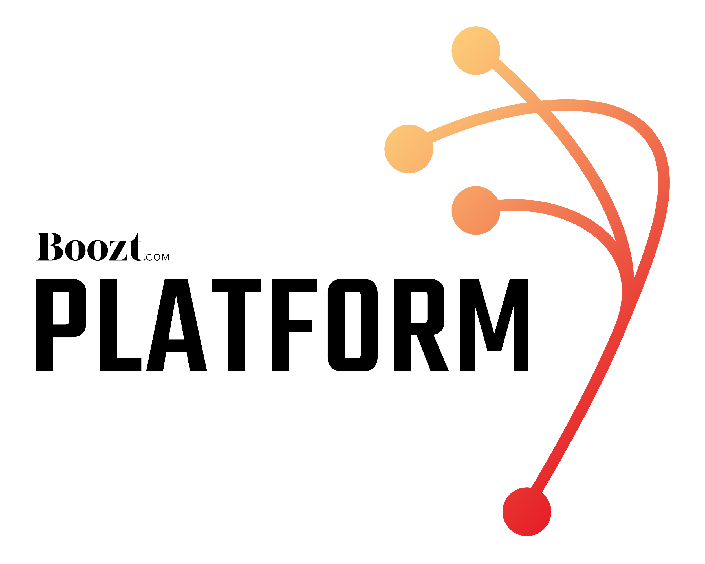

# pre-commit-hooks

A collection of pre-commit hooks for various development tools using the [pre-commit](https://pre-commit.com/) framework.

- [Available Hooks](#available-hooks)
  - [Terraform](#terraform)
- [About Boozt](#about-boozt)
- [Reporting Issues](#reporting-issues)
- [Contributing](#contributing)
- [License](#license)

## Available Hooks

Currently, the following hooks are supported:

### Terraform

TODO: add commands to test Terraform and Terramate development process.

## Reporting Issues

We use GitHub [Issues](https://github.com/boozt-platform/pre-commit-hooks/issues) to track community reported issues and missing reatures.

## Contributing

Contributions are highly valued and very welcome! For the process of reviewing changes, we use [Pull Requests](https://github.com/boozt-platform/pre-commit-hooks/pulls). For a detailed information please follow the [Contribution Guidelines](.github/CONTRIBUTING.md)

## License

This project is licensed under the MIT. Please see [LICENSE](./LICENSE) for full details.

Copyright &copy; 2024 Boozt Fashion, AB.
